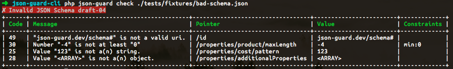

# json-guard-cli

[![Latest Version on Packagist][ico-version]][link-packagist]
[![Software License][ico-license]](LICENSE.md)
[![Build Status][ico-travis]][link-travis]
[![Coverage Status][ico-scrutinizer]][link-scrutinizer]
[![Quality Score][ico-code-quality]][link-code-quality]
[![Total Downloads][ico-downloads]][link-downloads]

This package is a CLI client for [JSON Guard](json-guard.thephpleague.com), a JSON Schema validator.  You can easily validate data against a schema or check your schema itself.



## Install

Installation uses [Composer](getcomposer.org).

### Project Install

``` bash
$ composer require yuloh/json-guard-cli
```

### Global Install

If you don't want to install this per project, you can install it globally and use it anywhere.  If you aren't familiar with Composer's global install functionality, [this tutorial should get you up and running](https://akrabat.com/global-installation-of-php-tools-with-composer/).

```bash
$ composer global require yuloh/json-guard-cli
```

## Usage

### Validate

Validate Data Against a Schema.

Usage:

```bash
$ json-guard validate [<data>] [<schema>]
```

Arguments:

* data: The data to validate.
* schema: The schema to use.

Examples:

```bash
# Using files
$ json-guard validate my-data.json my-schema.json
# Using JSON strings
$ json-guard validate \
'{ "id": "https://json-guard.dev/schema#" }' \
'{ "properties": { "id": { "type": "string", "format": "uri" } } }'
# Loading Schema with a Loader
$ json-guard validate my-data.json 'http://json-schema.org/draft-04/schema#'
```

### Check

Check that a JSON Schema is valid.

Usage:

```bash
$ json-guard check [<schema>]
```

Arguments:

* schema: The schema to check.

Examples:

```bash
$ json-guard check my-schema.json
```

### Loading JSON

All commands can load the JSON as a string, from a loader path, from a local file path, or from STDIN.

## Change log

Please see [CHANGELOG](CHANGELOG.md) for more information what has changed recently.

## Testing

``` bash
$ composer test
```

## Contributing

Please see [CONTRIBUTING](CONTRIBUTING.md) and [CONDUCT](CONDUCT.md) for details.

## Credits

- [Matt Allan][link-author]
- [All Contributors][link-contributors]

## License

The MIT License (MIT). Please see [License File](LICENSE.md) for more information.

[ico-version]: https://img.shields.io/packagist/v/yuloh/json-guard-cli.svg?style=flat-square
[ico-license]: https://img.shields.io/badge/license-MIT-brightgreen.svg?style=flat-square
[ico-travis]: https://img.shields.io/travis/yuloh/json-guard-cli/master.svg?style=flat-square
[ico-scrutinizer]: https://img.shields.io/scrutinizer/coverage/g/yuloh/json-guard-cli.svg?style=flat-square
[ico-code-quality]: https://img.shields.io/scrutinizer/g/yuloh/json-guard-cli.svg?style=flat-square
[ico-downloads]: https://img.shields.io/packagist/dt/yuloh/json-guard-cli.svg?style=flat-square

[link-packagist]: https://packagist.org/packages/yuloh/json-guard-cli
[link-travis]: https://travis-ci.org/yuloh/json-guard-cli
[link-scrutinizer]: https://scrutinizer-ci.com/g/yuloh/json-guard-cli/code-structure
[link-code-quality]: https://scrutinizer-ci.com/g/yuloh/json-guard-cli
[link-downloads]: https://packagist.org/packages/yuloh/json-guard-cli
[link-author]: https://github.com/yuloh
[link-contributors]: ../../contributors
